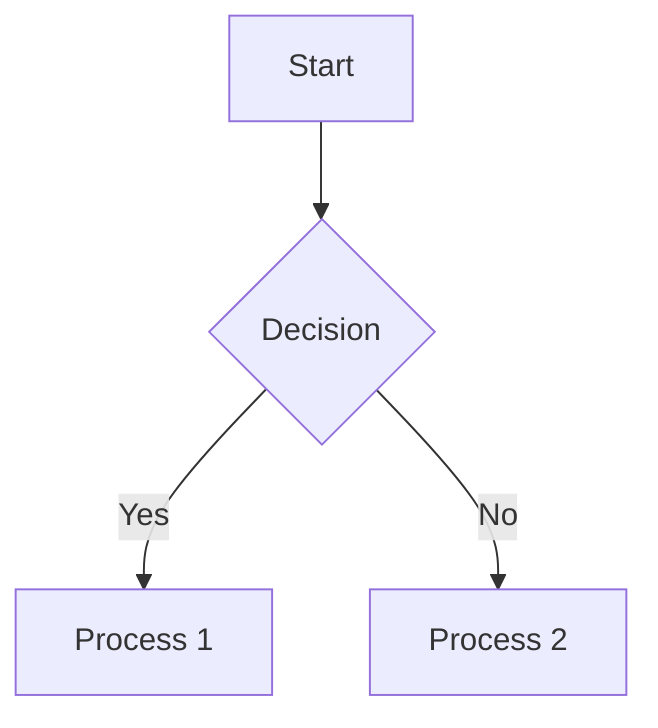

<h1>タイトル</h1>

サンプルmarkdownです。  
#がある文字が目次に追加されます。目次に追加したくない場合は\<h1>タグを使用してください

<h2>目次</h2>

[TOC]

# 1.大項目1

- 項目
- 項目
- 項目

# 2.大項目2

1. 項目
2. 項目
3. 項目

## 2.1.中項目1

| 項目 | 項目 | 項目 |
| ---- | ---- | ---- |
| 項目 | 項目 | 項目 |

## 2.2.中項目2

```text
コードブロック
```

### 2.2.1.画像


### 2.2.2.Mermaid記法


